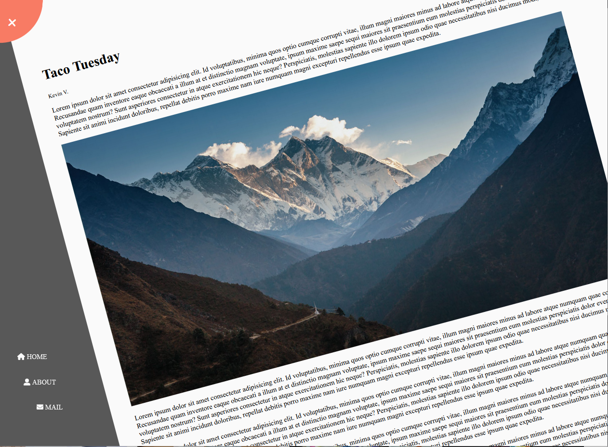

# 📸 Rotating Navigation Panel Website – Day 3 Project

Welcome to my project in my daily coding journey!  
This project focuses on building a rotating navigation panel using CSS transforms, Font Awesome icons, and JavaScript event handling. The goal was to experiment with how rotation affects layout and how to trigger visual transitions with button clicks.

---

## What It Does:

- Rotates the entire page container when the navigation is toggled  
- Shows and hides navigation items using animation  
- Allows navigation icons to slide in from the side when activated  
- Keeps the corner menu button fixed and functional  
- Uses Font Awesome icons for visual styling  

---

## 🔍 Preview

---

## What I Learned:

- How to rotate a full layout around a custom transform origin  
- How `overflow-x` and `overflow-y` work to control scroll behavior  
- How to use `querySelector()` and `getElementById()` correctly  
- How to navigate and animate list elements (`<ul><li>`)  
- How Lorem Ipsum works to generate placeholder text  
- How to properly load and use Font Awesome icons  

---

## What Went Wrong:

- Icons and text weren’t appearing at first — turns out I forgot to add `px` units to values like `top`, `left`, and `bottom`  
- JavaScript wasn’t affecting the container — I used `getElementById('.container')` instead of `querySelector()`  
- Font Awesome icons loaded, but the nav list items were still off-screen because I didn’t include the rule to slide them back in with `.show-nav`  

### The Fix:

- Added `px` to all position values (e.g., `bottom: 40px;`)  
- Replaced `getElementById('.container')` with `querySelector('.container')`  
- Added the missing CSS to bring nav list items back in when `.show-nav` is applied  
- Ensured all nav items had matching, valid Font Awesome icon classes  

---

## 🚀 Future Ideas

- Add content animations or fade-in transitions during rotation  
- Add a dark/light mode toggle to the nav menu  
- Turn the rotating nav into a full mobile-friendly sidebar  
- Include a page overlay when the nav is open  

---

## 🗣 General Comments / Questions

This was my **Day 3 project**, where I practiced building a **rotating navigation page**.  

Some of the key things I learned were:
- How fonts are loaded and activated  
- How Lorem Ipsum helps with layout testing  
- How to animate `ul > li` elements with different transform values  
- How to spin the entire layout from the top-left corner using `transform-origin`  
- How scroll behavior can be controlled with `overflow-x` and `overflow-y`  

Some issues I had were small but important — like missing `px` in positioning or not having the right JavaScript selector, which caused the rotation effect or icons not to appear.

It was a fun challenge, and a great stepping stone into more advanced layout animation!